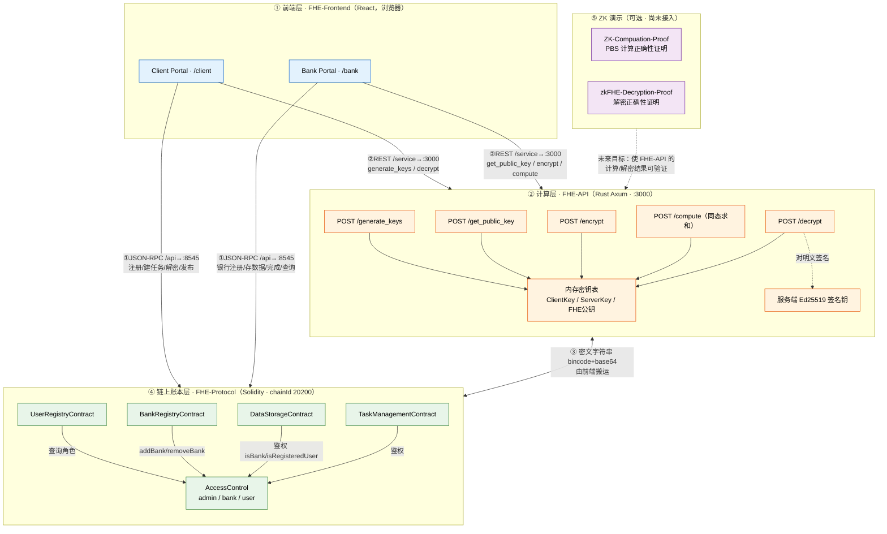
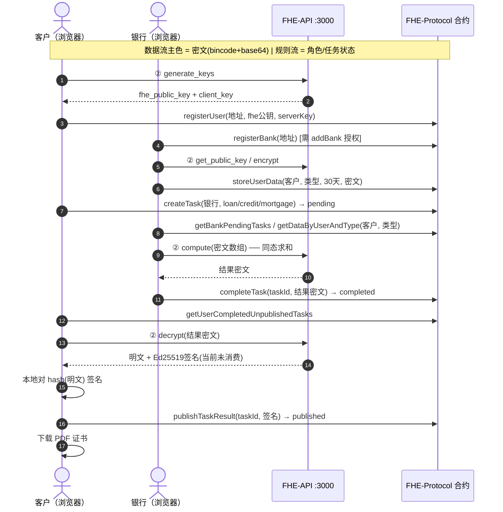

# CipherBridge 架构说明图（组件 × 调用关系 × 数据流）

> 配套阅读：`CipherBridge_API_MANUAL.md`（API 调用手册）。
> Mermaid 图可在支持 Mermaid 的 Markdown 渲染器（VSCode 插件、Typora、语雀等）中渲染。

## 图 A：系统架构总图（Mermaid flowchart）



## 图 B：编号数据流（Mermaid sequence，端到端主流程）



## 图 C：纯文本版主图

```text
                   CipherBridge：组件 × 调用关系 × 数据流

┌───────────────────────────────────────────────────────────────────────────────┐
│ ① 用户/浏览器层 · FHE-Frontend（React）                                          │
│    ┌────────────────────────┐            ┌────────────────────────┐            │
│    │ Client Portal /client  │            │ Bank Portal /bank      │            │
│    │ ·生成FHE密钥/注册       │            │ ·银行注册/加密数据上链  │            │
│    │ ·建任务/解密/签名/发布  │            │ ·取密文/同态求和/完成   │            │
│    │ ·下载PDF证书           │            │                        │            │
│    └─────────┬──────────────┘            └───────────┬────────────┘            │
└──────────────┼────────────────────────────────────────┼────────────────────────┘
               │ ②REST /service→:3000                   │ ②REST /service→:3000
               │   generate_keys / decrypt              │   get_public_key / encrypt / compute
               ▼                                        ▼
┌───────────────────────────────────────────────────────────────────────────────┐
│ ② 链下计算层 · FHE-API（Rust Axum · :3000）—— “唯一能碰明文的一方”                │
│   /generate_keys  /get_public_key  /encrypt  /compute  /decrypt               │
│   内存密钥表: ClientKey / ServerKey / FHE公钥（重启即丢） + Ed25519 签名钥         │
│   ⚠ 同时持有解密钥 ⇒ 半可信计算节点；无鉴权                                      │
└───────────────────────────────┬───────────────────────────────────────────────┘
                                │ ③ 密文在两者间搬运（前端/脚本为搬运工）
                                │    载体统一: bincode 序列化 + base64 字符串
                                ▼
┌───────────────────────────────────────────────────────────────────────────────┐
│ ④ 链上账本层 · FHE-Protocol（Solidity · chainId 20200，/api 代理→127.0.0.1:8545）│
│   AccessControl(admin/bank/user)  UserRegistryContract(用户+FHE公钥)           │
│   BankRegistryContract(银行)       DataStorageContract(加密数据+过期时间)        │
│   TaskManagementContract(任务状态机: pending→completed→published + 结果密文+签名)│
│   数据面：只存密文，永不触明文   |   规则面：谁可注册/存数/建单/交结果/发布          │
└───────────────────────────────▲───────────────────────────────────────────────┘
                                │ ⑤ 未来：把 ③ 变成可验证证明
        ┌───────────────────────┴────────────────────────────┐
        │  ZK 演示（RISC Zero · 可选 · 尚未接入主流程）          │
        │  ZK-Compuation-Proof  → 证明 PBS 计算被正确执行       │
        │  zkFHE-Decryption-Proof → 证明“该密文确解出该明文”     │
        └──────────────────────────────────────────────────────┘
```

## 图 D：信任边界（安全视角）

```text
            ┌──────────── 链上（公开，任何人可读）────────────┐
            │  只存密文/公钥/签名   →  看见密文 ≠ 看见明文      │
            └────────────────────────────┬──────────────────┘
                                         │
  明文可见性只在：浏览器(用户侧) 与  FHE-API（持有 ClientKey）
              └──────────────┬──────────────┘
             半可信边界 ──────┘   ZK 证明的目标：把对 FHE-API 的信任降到最低
```

## 图例与说明

| 编号 | 流 | 含义 | 载体 / 协议 |
|---|---|---|---|
| ① | 调用流（前端⇄链） | 前端对合约的读写 | ethers.js over HTTP JSON-RPC（vite 代理 `/api`→127.0.0.1:8545） |
| ② | 调用流（前端⇄FHE-API） | 密钥/加解密/同态计算 | axios REST JSON（vite 代理 `/service`→3000） |
| ③ | 数据流（链⇄FHE-API） | 密文与公钥串在两侧流动，前端/脚本做“搬运工” | bincode 序列化 + base64 字符串 |
| ④ | 数据流（合约内部） | 角色查询、注册写入、数据存证、任务状态机 | 合约间调用 `AccessControl` |
| ⑤ | 未来扩展（可选） | 用 ZK 证明 FHE 计算/解密正确 | RISC Zero receipt（当前为独立演示，未接入） |

## 要点总结

- **分层职责**：前端 = 业务编排；FHE-API = 密码学计算（能碰明文）；FHE-Protocol = 链上规则与密文存证；ZK = 可验证性。
- **合流点**：FHE-API 与 FHE-Protocol **不直接互通**；两条线在前端（或自动化脚本）处汇合，前端用同一把“用户钱包地址”做两边的身份关联（FHE-API 的 `public_key` = 链上钱包地址）。
- **关键安全事实**：链上永远只有密文，但 FHE-API 同时持有 ClientKey/ServerKey，是当前系统里唯一能解密全部数据的一方（半可信）；ZK 两个模块正是为将来降低这一信任而设。
- **当前断点/脏点**：BankRegistry.registerBank 死分支 bug、密钥仅存内存且无鉴权、注册时 serverKey 占位、发布签名链上不校验、两套数据类型命名、ZK 未接入——详见 `CipherBridge_API_MANUAL.md` 第 12 节。


